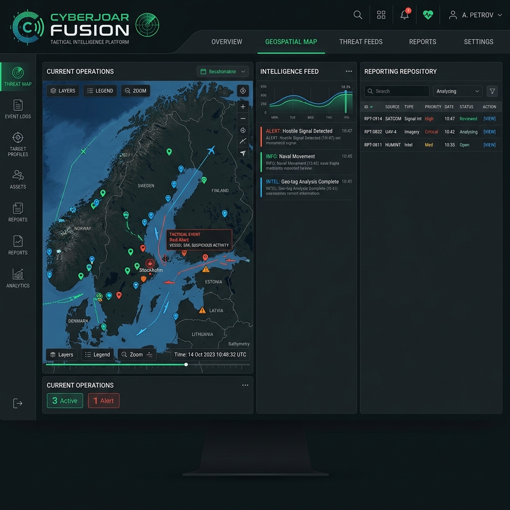

# 🛡️ CyberJoar Fusion: Tactical Intelligence System

[](https://reactjs.org/)
[](https://nodejs.org/)
[](https://www.mongodb.com/)
[](https://tailwindcss.com/)

**CyberJoar Fusion** is a high-fidelity, open-source Common Operating Picture (COP) designed for field commanders, strategic analysts, and tactical agents. It fuses multiple intelligence streams—OSINT, HUMINT, and IMINT—into a single, unified geospatial interface to provide total situational dominance.



---

## 🚀 Mission-Critical Modules

### 1. 🛰️ Intelligence Fusion Grid
*   **Tactical Mapping**: Integrated high-resolution terrain, satellite, and tactical dark mode grids using Leaflet.js.
*   **Signal Clustering**: Real-time grouping of dense intelligence nodes to maintain operational clarity.
*   **Predictive Trajectories**: Advanced vector overlays visualizing potential asset movement paths.
*   **Fly-to Logic**: Instant grid centering on critical signals or new intelligence ingestion.

### 2. 📊 Predictive Urban Growth
*   **AI-Driven Modeling**: Evaluation of real estate hotspots based on infrastructure, demand, and growth velocity.
*   **Growth Score (0-100)**: Real-time velocity score with automated classification (High Growth, Emerging, Stable).
*   **Investment Roadmap**: ROI outlooks and action recommendations (Buy, Hold, Premium).
*   **Dynamic Analytics**: Interactive Recharts visualization for price trends and rental yields.

### 3. 📂 Tactical Repository (Reports)
*   **Automated Scheduling**: Define report titles, priorities, and frequencies for future intelligence generation.
*   **Smart Filtering**: Instant category-based filtering (Intelligence, Predictive, System, Operational).
*   **Encrypted Exports**: AES-256 logged audit trails for all intelligence documentation.

### 4. 📤 Data Extraction Gateway
*   **Multi-Format Export**: Extract platform data into verified **JSON**, **CSV**, or high-fidelity **PDF** formats.
*   **Geospatial Sync**: Coordinate-mapped datasets ready for external GIS platform integration.
*   **Security Protocol**: All extractions are logged in the system audit trail for total transparency.

---

## 🔐 Role-Based Access Control (RBAC)

| Role | Access Level | Capabilities |
| :--- | :--- | :--- |
| **Operational Commander** | Level 3 | Full system control, bulk ingestion, and global analytics. |
| **Intelligence Analyst** | Level 2 | Strategic database access, pattern recognition, and reporting. |
| **Field Agent** | Level 1 | Reporting, grid visualization, and tactical activity feeds. |

---

## 🛠️ Technical Architecture

### **Frontend**
- **React 18**: UI component architecture.
- **Framer Motion**: Smooth, high-fidelity micro-animations.
- **Leaflet.js**: High-performance geospatial rendering.
- **Tailwind CSS**: Glassmorphism and tactical dark mode styling.

### **Backend**
- **Node.js & Express**: High-concurrency intelligence API.
- **MongoDB**: $2dsphere geospatial indexing for lightning-fast location queries.
- **JWT Security**: Stateless authentication for secure operational sessions.
- **Cloudinary**: Secure image storage for IMINT assets.

---

## 🏁 Deployment Guide

### **1. Prerequisites**
- Node.js (v16+)
- MongoDB Atlas account (or local instance)
- Cloudinary account (for IMINT uploads)

### **2. Environment Configuration**
Create a `.env` file in the `/backend` directory:
```env
PORT=5000
MONGODB_URI=your_mongodb_connection_string
JWT_SECRET=your_tactical_secret_key
CLOUDINARY_CLOUD_NAME=your_name
CLOUDINARY_API_KEY=your_key
CLOUDINARY_API_SECRET=your_secret
```

### **3. Installation**

#### **Tactical Backend**
```bash
cd backend
npm install
npm run dev
```

#### **Strategic Frontend**
```bash
cd frontend
npm install
npm run dev
```

---

## 🔑 Rapid Access Credentials
For evaluation and testing, use the built-in deployment profiles:
- **Commander**: `commander@cyberjoar.ai` / `commander123`
- **Analyst**: `analyst@cyberjoar.ai` / `analyst123`
- **Field Agent**: `agent@cyberjoar.ai` / `agent123`

---

© 2026 CYBERJOAR TACTICAL SYSTEMS | CLASSIFIED PROJECT
*Developed for the CYBERJOAR AI Assignment*
